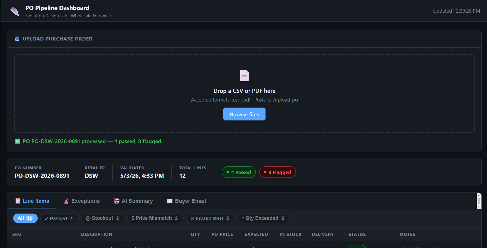
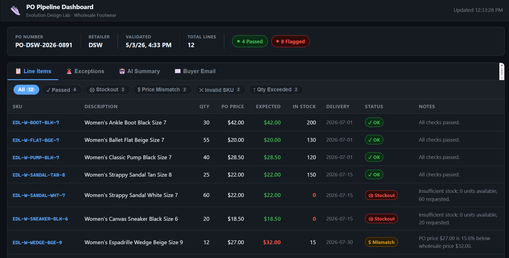
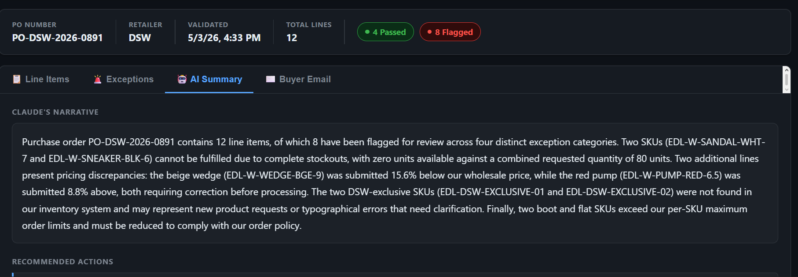
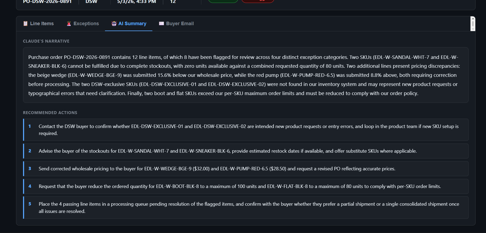
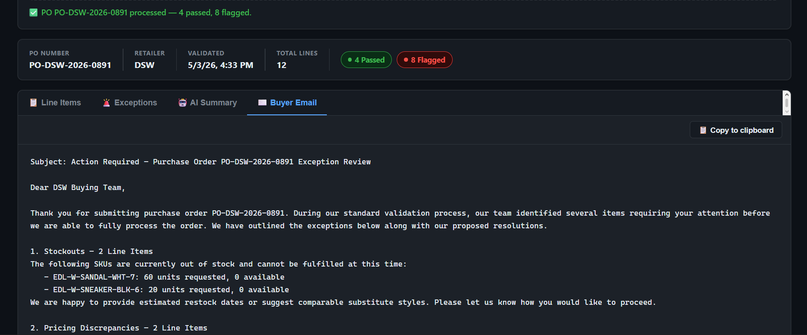

# Wholesale PO Processing Pipeline

> **Disclaimer:** This project uses fictional purchase order data for demonstration
> purposes only. Retailer names (JCPenney, DSW, Famous Footwear) are referenced solely as
> realistic stand-ins and are not affiliated with or endorsing this project.

## Project Description

This pipeline automates purchase order processing for Evolution Design Lab, a wholesale
footwear company supplying JCPenney, Famous Footwear, and DSW. When a retailer submits a
PO as a CSV or PDF, the system parses the line items, validates each one against live
SQLite inventory, and uses the **Claude AI API** to generate plain-English exception
summaries, recommended actions, and a ready-to-send buyer email — all in seconds, with no
manual review needed for clean orders. A browser-based dashboard lets ops staff upload
files, view validation results, and copy the AI-drafted email with one click.

---

## Architecture

```
┌────────────────────────────────────────────────────────────┐
│                        INPUT LAYER                         │
│           CSV File  ──────┐   PDF File                     │
│                           ▼                                │
│                 POST /upload-po (FastAPI)                   │
└───────────────────────────┬────────────────────────────────┘
                            │
              ┌─────────────▼─────────────┐
              │     pipeline/ingest.py    │
              │   parse_csv / parse_pdf   │
              │     → PODocument          │
              └─────────────┬─────────────┘
                            │
              ┌─────────────▼─────────────┐
              │    pipeline/validate.py   │
              │  Query SQLite inventory   │
              │  Check: SKU, stock,       │
              │  price tolerance, max qty │
              │     → ValidationReport    │
              └──────┬──────────┬─────────┘
                     │          │
               passed > 0    flagged > 0
                     │          │
                     │  ┌───────▼──────────────┐
                     │  │ pipeline/exceptions.py│
                     │  │  Claude API call      │
                     │  │  → ExceptionSummary   │
                     │  └───────┬──────────────┘
                     │          │
              ┌──────▼──────────▼──────────┐
              │     db/database.py         │
              │  Store in processed_pos    │
              │  (SQLite) + logs/          │
              └────────────────────────────┘
                            │
              ┌─────────────▼─────────────┐
              │  Browser Dashboard (/)    │
              │  or JSON API response     │
              │  or n8n workflow node     │
              └─────────────┬─────────────┘
                            │
              ┌─────────────▼─────────────┐
              │       n8n Workflow         │
              │  IF flagged → Gmail email  │
              │  ELSE       → Slack #ops   │
              └────────────────────────────┘
```

---

## Features

| Feature | Details |
|---|---|
| **File ingestion** | CSV and PDF purchase orders via multipart upload |
| **Inventory validation** | 4 exception types: stockout, price mismatch, invalid SKU, quantity exceeded |
| **AI exception summaries** | Claude `claude-sonnet-4-6` generates narrative, action items, and buyer email draft |
| **Browser dashboard** | Drag-and-drop upload, filterable line-item table, exception cards, AI summary, one-click email copy |
| **REST API** | FastAPI with OpenAPI docs at `/docs` |
| **Automation** | n8n v1.x workflow: watches folder → validates → Gmail on exception / Slack on clean |
| **Persistence** | SQLite stores every processed PO; JSON logs written to `logs/` |

---

## Dashboard

Open `http://localhost:8000` after starting the API to access the full-featured ops
dashboard:



After uploading a CSV or PDF the PO summary bar updates instantly and the four tabs
populate with live data:

**Line Items** — filterable table with status badges, PO price vs expected price, stock
on hand, and per-line notes:



**AI Summary** — Claude's plain-English narrative describing every exception category:



Followed by numbered recommended actions for the ops team:



**Buyer Email** — ready-to-send draft with one-click clipboard copy:



---

## Setup

```bash
# 1. Clone and install
git clone https://github.com/Anirudh-Ka/wholesale-po-pipeline.git
cd wholesale-po-pipeline
pip install -r requirements.txt

# 2. Configure environment
cp .env.example .env
# Edit .env and set your Anthropic API key:
#   ANTHROPIC_API_KEY=sk-ant-...

# 3. Initialise and seed the database
python -c "from db.database import init_db; init_db()"

# 4. Generate the sample PDF (optional — sample_po.csv works without it)
python data/generate_pdf.py

# 5. Start the API
uvicorn api.main:app --reload --port 8000
```

Open **http://localhost:8000** for the dashboard, or use the curl commands below.

---

## API Endpoints

| Method | Path | Description |
|---|---|---|
| `GET` | `/` | Browser dashboard |
| `GET` | `/health` | Health check |
| `POST` | `/upload-po` | Upload CSV or PDF, run full pipeline |
| `GET` | `/report/{po_number}` | Retrieve stored `ValidationReport` |
| `GET` | `/exceptions/{po_number}` | Retrieve stored `ExceptionSummary` |
| `GET` | `/docs` | Interactive Swagger UI |

### Health check
```bash
curl http://localhost:8000/health
# {"status":"ok"}
```

### Upload a PO
```bash
curl -X POST http://localhost:8000/upload-po \
  -F "file=@data/sample_po.csv"
```

### Retrieve a validation report
```bash
curl http://localhost:8000/report/PO-JCP-2026-0412
```

### Retrieve exception summary
```bash
curl http://localhost:8000/exceptions/PO-JCP-2026-0412
```

---

## Sample Output

### POST /upload-po
```json
{
  "po_number": "PO-JCP-2026-0412",
  "status": "flagged",
  "validation_report": {
    "po_number": "PO-JCP-2026-0412",
    "validated_at": "2026-05-03T12:00:00",
    "total_lines": 12,
    "passed": 4,
    "flagged": 8,
    "line_results": [
      {
        "line_item": {
          "sku": "EDL-W-PUMP-BLK-7",
          "description": "Women's Classic Pump Black Size 7",
          "retailer": "JCPenney",
          "quantity": 60,
          "unit_price": 28.50,
          "requested_delivery": "2026-06-15"
        },
        "status": "ok",
        "available_stock": 120,
        "expected_price": 28.50,
        "notes": "All checks passed."
      },
      {
        "line_item": {
          "sku": "EDL-W-SANDAL-WHT-7",
          "description": "Women's Strappy Sandal White Size 7",
          "retailer": "JCPenney",
          "quantity": 80,
          "unit_price": 22.00,
          "requested_delivery": "2026-06-15"
        },
        "status": "stockout",
        "available_stock": 0,
        "expected_price": 22.00,
        "notes": "Insufficient stock: 0 units available, 80 requested."
      }
    ]
  },
  "exception_summary": {
    "po_number": "PO-JCP-2026-0412",
    "generated_at": "2026-05-03T12:00:05",
    "narrative": "PO-JCP-2026-0412 from JCPenney contains 8 flagged line items out of 12 total. Two SKUs are completely out of stock, two carry pricing that falls outside the 5% tolerance, two SKUs are unrecognised in the inventory system, and two lines exceed the maximum order quantity.",
    "recommended_actions": [
      "Contact JCPenney buyer to advise on stockout items EDL-W-SANDAL-WHT-7 and EDL-W-SNEAKER-BLK-6.",
      "Correct pricing discrepancies on EDL-W-PUMP-RED-6.5 and EDL-W-WEDGE-BGE-9 before confirming.",
      "Verify SKUs EDL-FAKE-SKU-001 and EDL-FAKE-SKU-002 with the buyer — not in inventory.",
      "Request revised quantities for EDL-W-BOOT-BLK-8 and EDL-W-FLAT-BLK-8 (exceed 200-unit limit)."
    ],
    "email_draft": "Dear JCPenney Buyer,\n\nThank you for submitting purchase order PO-JCP-2026-0412. We have completed our initial review and need to flag several items before we can confirm fulfilment...\n\nBest regards,\nEvolution Design Lab Operations Team"
  }
}
```

### GET /report/{po_number}
Returns the full `ValidationReport` JSON (same as `validation_report` above).

### GET /exceptions/{po_number}
Returns the full `ExceptionSummary` JSON, or `{"message": "no exceptions"}` if all lines passed.

---

## Running Tests

```bash
pytest tests/ -v
```

Tests use temporary SQLite databases via pytest fixtures. The Claude API is mocked in
`test_exceptions.py` so no API tokens are consumed during testing.

---

## Project Structure

```
po-pipeline/
├── api/
│   └── main.py              # FastAPI app — 5 endpoints + CORS
├── data/
│   ├── sample_po.csv        # 12-line mock PO (4 clean, 2 stockout, 2 price, 2 invalid, 2 qty)
│   ├── sample_po.pdf        # Same PO as PDF
│   ├── inventory_seed.sql   # 20+ footwear SKUs across 6 styles and 6 colors
│   └── generate_pdf.py      # Generates sample_po.pdf via reportlab
├── db/
│   ├── schema.sql           # inventory + processed_pos tables
│   └── database.py          # SQLite helpers (init, query, save)
├── pipeline/
│   ├── models.py            # Pydantic v2 models: PODocument, ValidationReport, ExceptionSummary
│   ├── ingest.py            # CSV and PDF parsing → PODocument
│   ├── validate.py          # Inventory validation → ValidationReport
│   └── exceptions.py        # Claude API call → ExceptionSummary
├── workflows/
│   └── po_pipeline.json     # n8n v1.x importable workflow
├── tests/
│   ├── test_ingest.py
│   ├── test_validate.py
│   └── test_exceptions.py   # Claude API mocked with pytest monkeypatch
├── dashboard.html           # Single-file browser dashboard (served at /)
├── requirements.txt
└── .env.example
```

---

## n8n Workflow Setup

1. Open your n8n instance (self-hosted or cloud).
2. Go to **Workflows → Import** and upload `workflows/po_pipeline.json`.
3. Configure credentials:
   - **Gmail OAuth2**: Add a Google OAuth2 credential under *Settings → Credentials*.
   - **Slack API**: Add a Slack Bot Token credential.
4. Update the **Watch Incoming Folder** node path to your `incoming/` directory.
5. Activate the workflow — drop any `.csv` or `.pdf` PO into `incoming/` to trigger it.

The workflow routes automatically: flagged orders trigger a Gmail notification to the
buyer; clean orders post a success message to the `#ops` Slack channel.

---

## API Documentation

FastAPI auto-generates interactive Swagger UI at:
```
http://localhost:8000/docs
```

---

## Technology Decisions

- **pypdf**: Pure-Python, zero system dependencies, handles the encrypted/compressed PDFs common in wholesale EDI.
- **SQLite**: No server process required; the entire inventory DB is a single file, trivial to swap for Postgres in production.
- **FastAPI**: Async-native, generates OpenAPI docs automatically, and has first-class multipart file upload support.
- **Pydantic v2**: Runtime data validation and serialisation with zero extra code; models double as input validators and JSON serialisers.
- **reportlab**: De-facto Python library for programmatic PDF generation — no headless browser or external service required.
- **Claude `claude-sonnet-4-6`**: Best balance of instruction-following and speed for structured JSON generation in an operational context.
